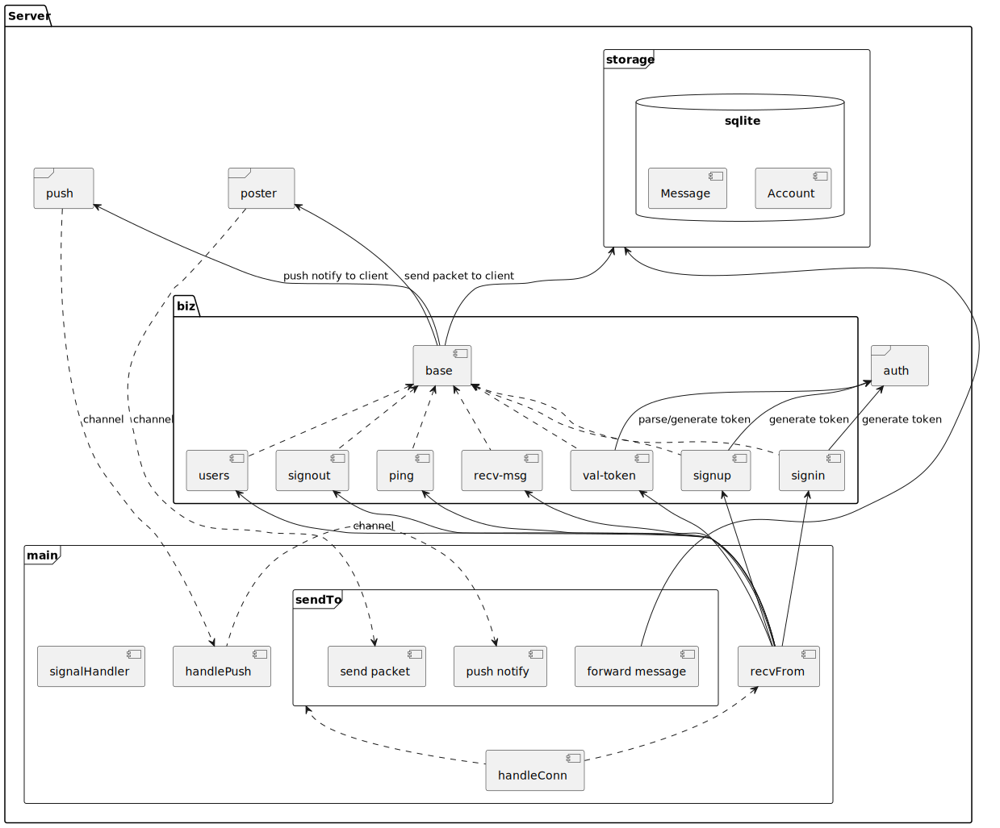

# GoChat

## v0.3 Release

* ui
* ...

### Run

* server


* client (huoyijie)


* client (jack)


### Features


### Diagrams

* lib


* server



* client


* sequence


## Docker

```bash
# work dir
cd server

# build executable
go build -o target/gochat-server

# build docker image
docker build -t huoyijie/gochat-server:latest .

# run docker c
docker run -it -v "$(pwd)"/target:/root/.gochat huoyijie/gochat-server:latest

# open container's shell
docker exec -it af2e58909af8 /bin/bash
```

```bash
sudo crictl --runtime-endpoint unix:///var/run/containerd/containerd.sock pull registry.cn-hangzhou.aliyuncs.com/google_containers/pause:3.6

sudo ctr -n k8s.io image tag registry.cn-hangzhou.aliyuncs.com/google_containers/pause:3.6 registry.k8s.io/pause:3.6

sudo kubeadm init  --v=6  --image-repository='registry.cn-hangzhou.aliyuncs.com/google_containers' --ignore-preflight-errors=all
```

Your Kubernetes control-plane has initialized successfully!

To start using your cluster, you need to run the following as a regular user:

```bash
mkdir -p $HOME/.kube
sudo cp -i /etc/kubernetes/admin.conf $HOME/.kube/config
sudo chown $(id -u):$(id -g) $HOME/.kube/config
```

Alternatively, if you are the root user, you can run:

```bash
export KUBECONFIG=/etc/kubernetes/admin.conf
```

You should now deploy a pod network to the cluster.
Run "kubectl apply -f [podnetwork].yaml" with one of the options listed at:
  https://kubernetes.io/docs/concepts/cluster-administration/addons/

Then you can join any number of worker nodes by running the following on each as root:

```bash
kubeadm join 172.21.0.16:6443 --token z6e2g0.ypj2pyv16nqdp4s2 \
    --discovery-token-ca-cert-hash sha256:3f0dcc6a62f3b53c65dadf4a662128501d7003e5d868fa13d68879da83aaf0d3
```

```bash
sudo systemctl restart kubelet containerd
kubectl apply -f https://github.com/flannel-io/flannel/releases/latest/download/kube-flannel.yml
```

## v0.4 todo

* tls
* emoji
* send file
* group chat