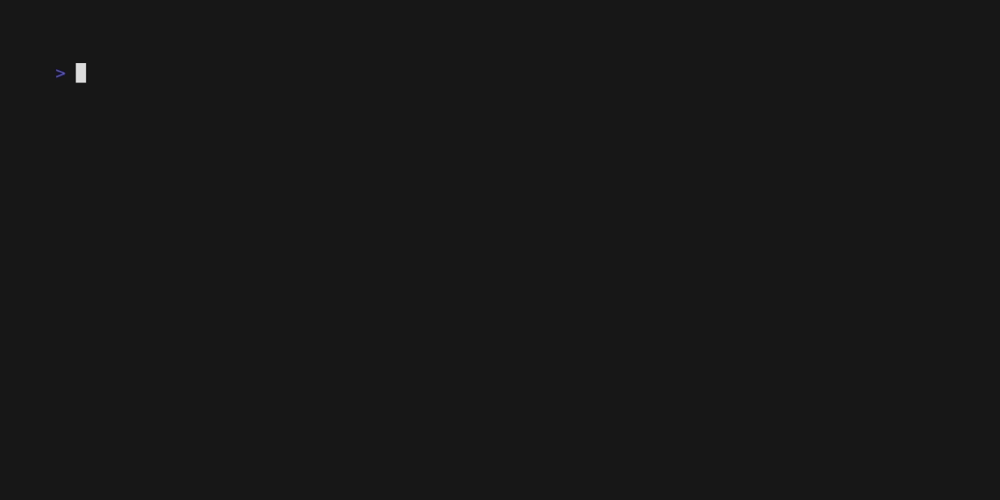
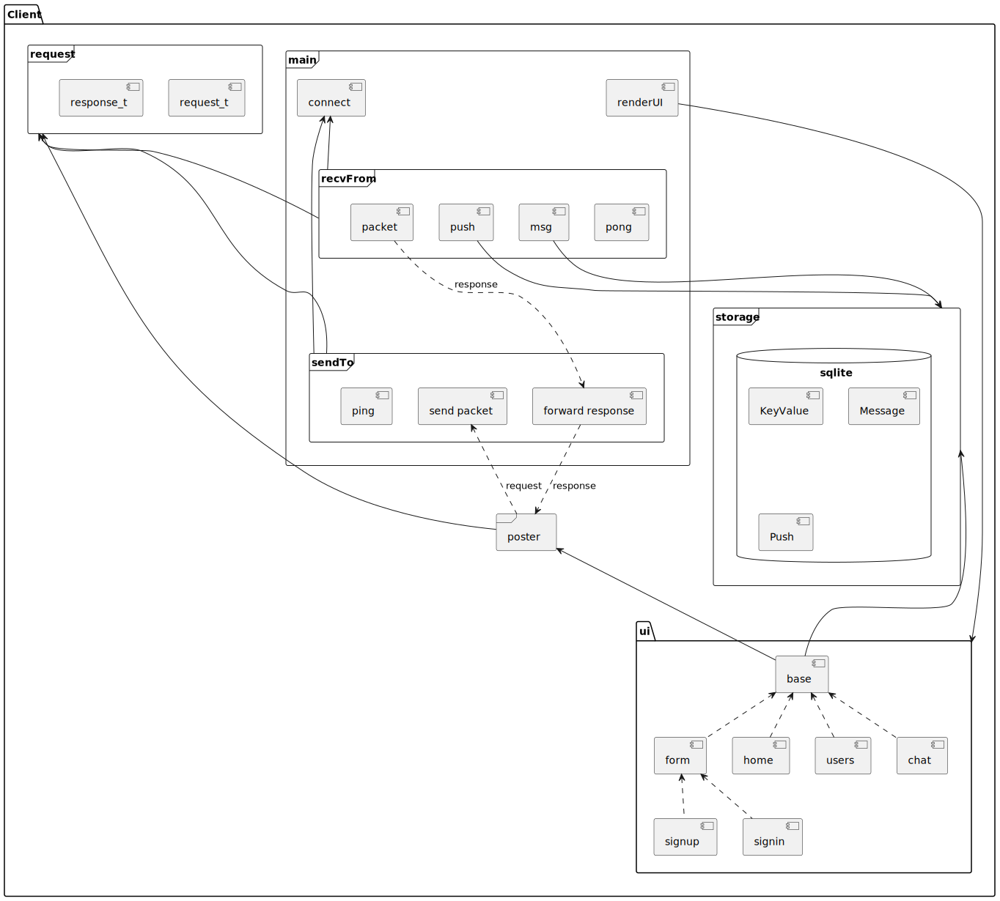

# GoChat

## v0.3 Release

* ui
* ...

### Run

* server


* client (huoyijie)


* client (jack)



### Features


### Diagrams

* lib


* server


* client



* sequence


## Docker

```bash
# work dir
cd server

# build executable
go build -o target/gochat-server

# build docker image
docker build -t gochat-server:latest .

# run docker c
docker run -it -v "$(pwd)"/target:/root/.gochat gochat-server:latest

# open container's shell
docker exec -it af2e58909af8 /bin/bash
```

## v0.4 todo

* tls
* emoji
* send file
* group chat